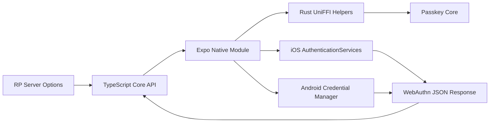

Most app developers can skip this page. It is for contributors and teams that need to know where validation, native UI, and WebAuthn JSON mapping happen.

## Package boundary

`expo-easy-passkey` is the only package users install. App code imports its public TypeScript API, and Expo uses the same package for autolinking and the config plugin. The package forwards public inputs to Rust-backed native helpers, normalizes base64url fields through UniFFI, forwards supported WebAuthn options to native code, and validates native response shapes.

Inside the repo, the app-facing TypeScript API, Expo native module bridge, Rust helpers, and generated bindings stay in separate source areas. They are implementation details of the single released npm package.

The Rust crates provide deterministic helpers for native code and tests. Rust does not create, store, or use private passkey material.

## Native ceremony

- iOS uses `AuthenticationServices`.
- Android uses AndroidX Credential Manager.
- Native code maps platform responses into WebAuthn JSON.

The platform authenticator creates and stores the passkey. The app receives a registration or authentication response that your server verifies.

## Rust helpers

- base64url normalization
- relying-party ID validation
- origin validation
- client-data JSON modeling for parity fixtures
- UniFFI-generated Swift and Kotlin bindings
- packaged iOS and Android native libraries used by those bindings at runtime

## Server boundary

Your server owns challenge generation, registration verification, storage of credential public keys, authentication verification, replay protection, and session creation. This library only runs the native ceremony and returns the JSON your server needs.
